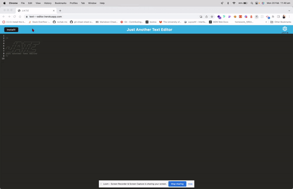
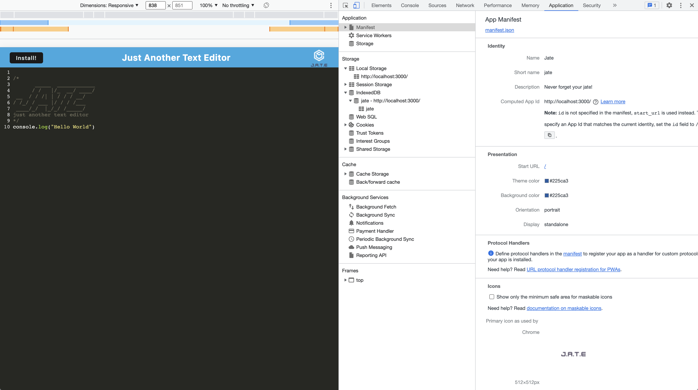
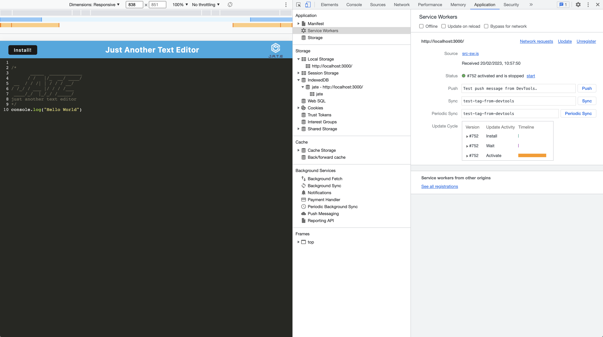
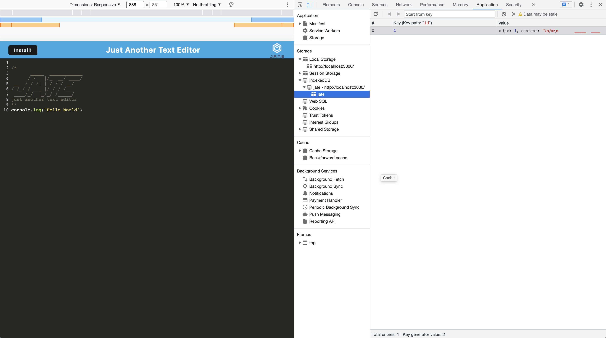

# Text_Editor

A text editor app, a single page application that meets the PWA criteria that runs in the browser. This application will also function offline.


## Description

A simple text editor app meets the PWA criteria that can function both online and offline. Needed to use a variety of data persistence options in order to ensure that data is not lost in any scenario. The application first looks to use the data in the indexedDB to populate the editor, then if it cannot access that it will use local storage. For use offline, this application can be downloaded to your desktop as an application. This application is helpful to developers because they can use this as a scratch pad for code snippets and coding ideas. This application is deployed on Heroku.

## Table of Contents (Optional)

- [Installation](#installation)
- [Usage](#usage)
- [Links](#links)
- [License](#license)
- [Contributing](#contributing)
- [Tests](#tests)
- [Questions](#questions)

## Installation

Clone the repo

    git clone https://github.com/rochak-ms/Text_Editor.git

Install dependencies (Ensure all dependencies are installed to the root directory)

       npm install

Use the below command in your terminal to start your client and server side and build web application.

    npm run start

This will install all dependancies for the front-end and back-end amd build your PWA.

Open the browser on the specified localhost URL to run this application on your local machine.

You can also install the program onto your desktop for offline use by visiting deployed link found below and installing in via the install btn.

## Usage

```AS A developer
I WANT to create notes or code snippets with or without an internet connection
SO THAT I can reliably retrieve them for later use
GIVEN a text editor web application
WHEN I open my application in my editor
THEN I should see a client server folder structure
WHEN I run `npm run start` from the root directory
THEN I find that my application should start up the backend and serve the client
WHEN I run the text editor application from my terminal
THEN I find that my JavaScript files have been bundled using webpack
WHEN I run my webpack plugins
THEN I find that I have a generated HTML file, service worker, and a manifest file
WHEN I use next-gen JavaScript in my application
THEN I find that the text editor still functions in the browser without errors
WHEN I open the text editor
THEN I find that IndexedDB has immediately created a database storage
WHEN I enter content and subsequently click off of the DOM window
THEN I find that the content in the text editor has been saved with IndexedDB
WHEN I reopen the text editor after closing it
THEN I find that the content in the text editor has been retrieved from our IndexedDB
WHEN I click on the Install button
THEN I download my web application as an icon on my desktop
WHEN I load my web application
THEN I should have a registered service worker using workbox
WHEN I register a service worker
THEN I should have my static assets pre cached upon loading along with subsequent pages and static assets
WHEN I deploy to Heroku
THEN I should have proper build scripts for a webpack application
```

### Demo

#



## Links

- A Heroku app [text-editor](https://text---editor.herokuapp.com/)

The following image shows the application's `manifest.json` file:



The following image shows the application's registered service worker:



The following image shows the application's IndexedDB storage:



## License

    This application is covered by the MIT license.


## Contributing

Pull request are welcome, you can make a constribution at the bottom of any docs page to make small changes such as a typo, sentence fix or a broken link. For major changes, please open an issue first to discuss what you would like to change.

## Tests

`none`

## Questions

If you have any question, Email me at: rochak.ms@gmail.com

Find me on GitHub: [Rochak-ms](https://github.com/rochak-ms)
